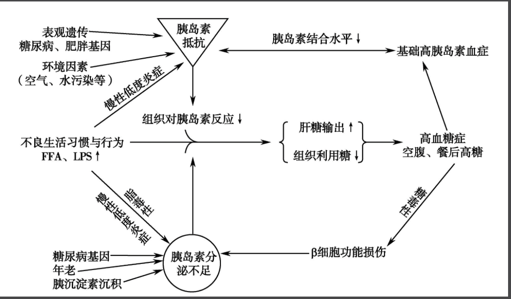

---
title: 1型与2型糖尿病的发病机制的主要差异是
date: 2023-02-26
tags: [""]
--- 

## Contents

1型糖尿病的发病机制为胰岛素的<strong>绝对缺乏</strong>常为自身免疫所引起
- 1型包括自身免疫急发型和缓发型,但是也包括<mark>一种无自身免疫证据的特发型</mark>

2型糖尿病的发病机制为胰岛素的相对性分泌不足和或胰岛素抵抗

## QnA

- 如何理解胰岛素的相对性分泌不足?
  - 比如有靶器官对胰岛素的反应下降,那么就需要更多的胰岛素去刺激它,这个时候就显得相对不足

## Ref
- [[2型糖尿病的主要致病因素是]]
- [[为什么肥胖会导致2型糖尿病]]
- [[2型糖尿病发病机制中脂毒性是指]]
- [[为什么巨噬细胞在2型糖尿病的发生发展中至为重要]]
